#github的注册
* 打开github.com 
* 点击sign in进行注册 
* 输入用户名，注册用邮箱，密码 
* 邮箱收到邮件进行验证 
* 打开Git的安装包安装，一直下一步到完成
#库的建立
* 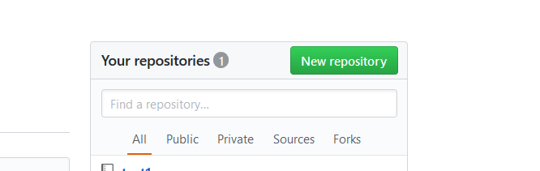
* 打开github.com,点击 NEW repository建立新的库
*  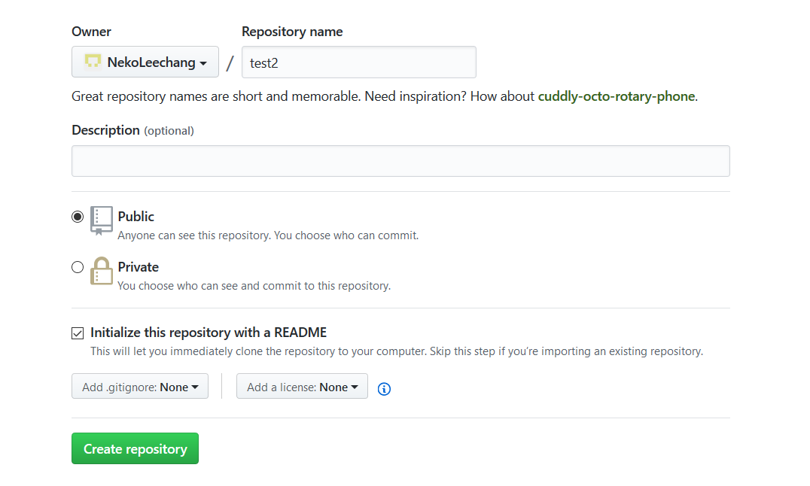
* 输入库名并勾选Initialize this repository with a README选项
#库的删除
* 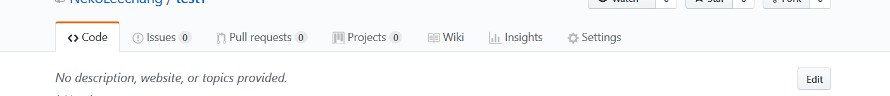
* 点击settings
* 拖动到最下方
* 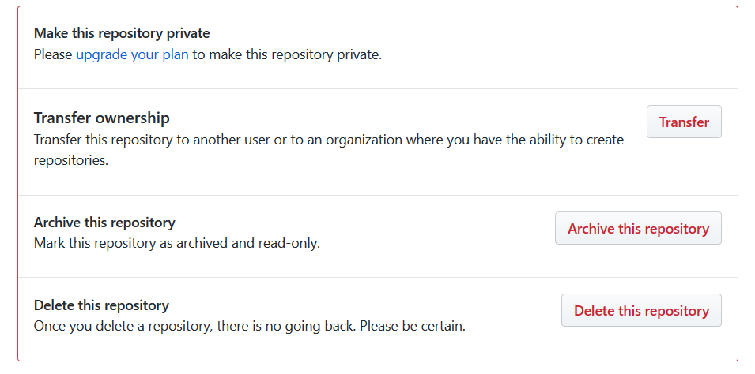
* 点击 delete this repository
*  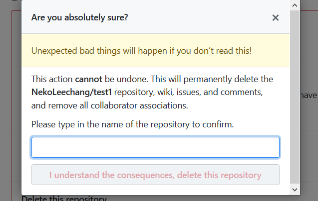
* 输入删除的库名
* 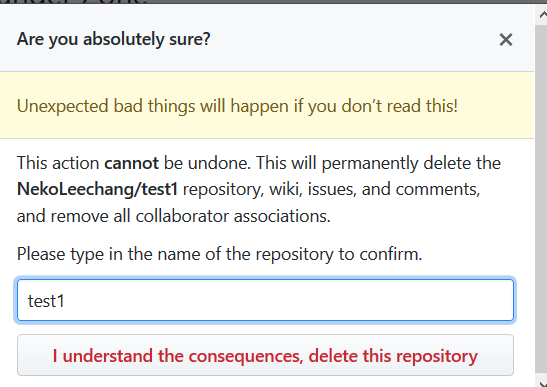
* 点击 I understand the consequences,delete this repository
#库的下载
* 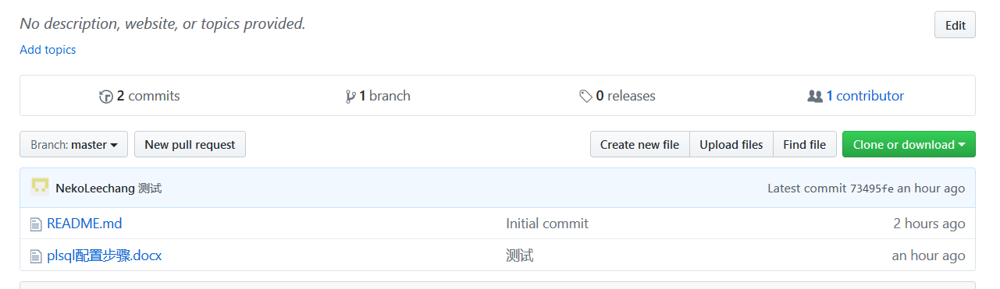
* 点击 Clone of download
* 复制网址
* 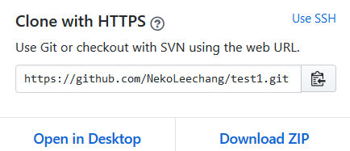
* 右键 选择 Git bush here
* 在$后输入 git clone +复制过来的网址
* 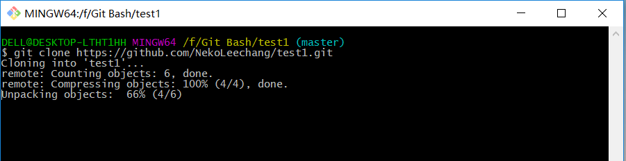
* 进入库，展示库内的文件
* 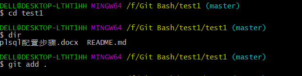
* 
* 输入 git add .
* 输入 git commit =m””   在引号内输入备注
* 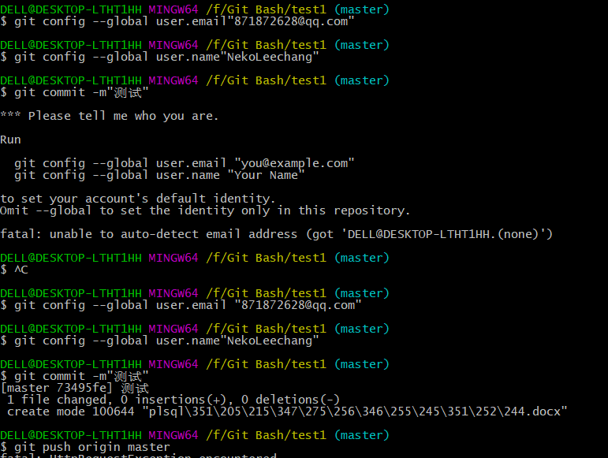
* 第一次输入邮箱和用户名
* 输入git push origin master
* 下载完成
* 输入git pull
* 更新本地库
* 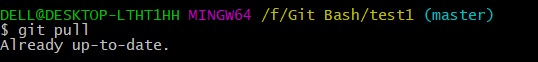
