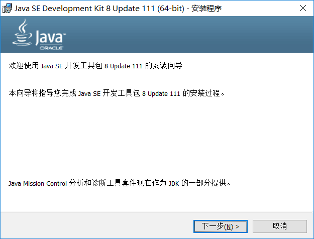
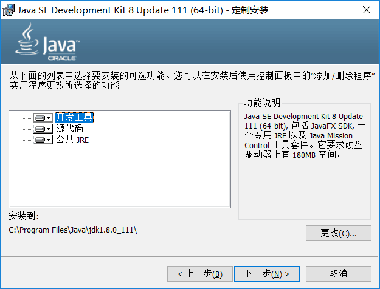
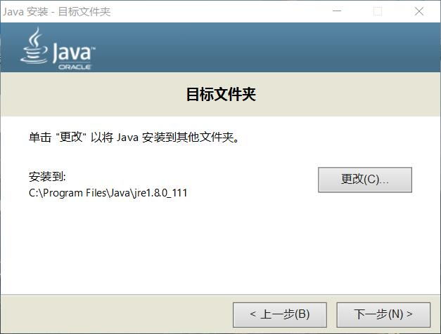
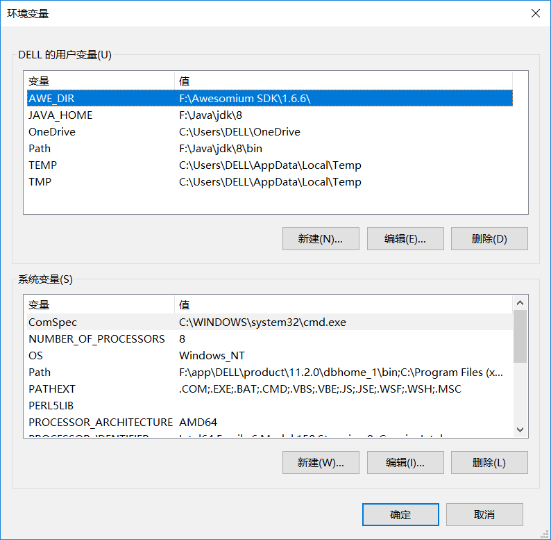
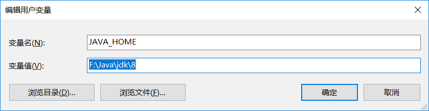
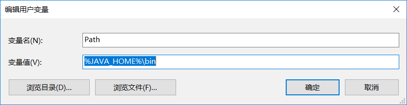
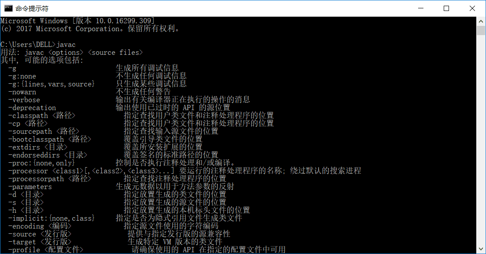

* 打开安装程序
* 
* 下一步
* 
* 下一步
* 等待弹出jre的安装
* 
* 安装jre
* 直到安装完成
* 配置环境变量
* 打开系统属性，选择环境变量
* 
* 在用户变量里新建 JAVA_HOME，变量值里选择安装目录
* 
* 在用户变量里新建Path，变量值改为 %JAVA_HOME%\BIN
* 
* 在CMD里打上JAVAC测试，出现以下界面便是测试完成
* 
* 