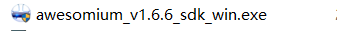
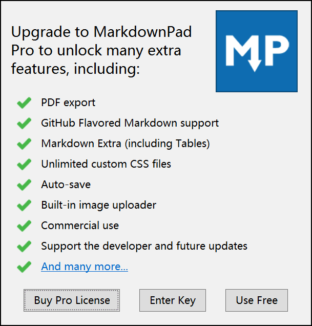

* 首先安装SDK文件
* 
* 一直下一步到这个页面选择安装目录，选择Complete
* 
* 安装完SDK后最好重启
* 再安装markdownpad2-setup
* 
* 
* 接受条款，下一步
* 
* 点击Enter Key
* 输入破解邮箱和密钥
* 
* 邮箱：Soar360@live.com
* 授权秘钥：GBPduHjWfJU1mZqcPM3BikjYKF6xKhlKIys3i1MU2eJHqWGImDHzWdD6xhMNLGVpbP2M5SN6bnxn2kSE8qHqNY5QaaRxmO3YSMHxlv2EYpjdwLcPwfeTG7kUdnhKE0vVy4RidP6Y2wZ0q74f47fzsZo45JE2hfQBFi2O9Jldjp1mW8HUpTtLA2a5/sQytXJUQl/QKO0jUQY4pa5CCx20sV1ClOTZtAGngSOJtIOFXK599sBr5aIEFyH0K7H4BoNMiiDMnxt1rD8Vb/ikJdhGMMQr0R4B+L3nWU97eaVPTRKfWGDE8/eAgKzpGwrQQoDh+nzX1xoVQ8NAuH+s4UcSeQ==
* 安装完成

