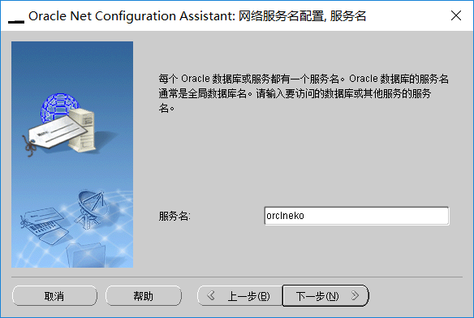
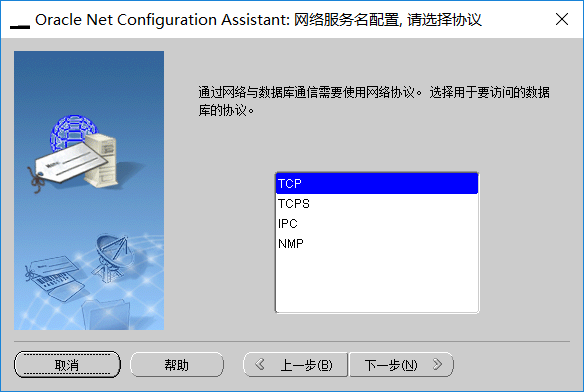

#plsql developer安装过程 
 
##测试监听
* 	shift 右击 打开powershell 窗口
* 输入"natca"
* 
* 	选本地网络服务名配置 单击下一步
* 	
* 		选添加 单击下一步
* 		
* 	输入服务名 点击下一步
* 		
* 	选TCP 单击下一步
* 		
* 填写主机IP地址，点击下一步
* 	
* 	选择测试 单击下一步
* 		
* 	安装splsql developer
* 	
* 	点击下一步到以下界面	
* 	
* 		选Custom单击下一步
* 		安装中文补丁
* 		
* 		点击帮助——注册
* 		33.	复制Product Code(产品编号）4t46t6vydkvsxekkvf3fjnpzy5wbuhphqz

serial Number(序列号)：601769

password(口令)：xs374ca
* 开工具选择首选项
* 可在首选项种选择字体大小与出发提示的字数
* 
* 
* 
